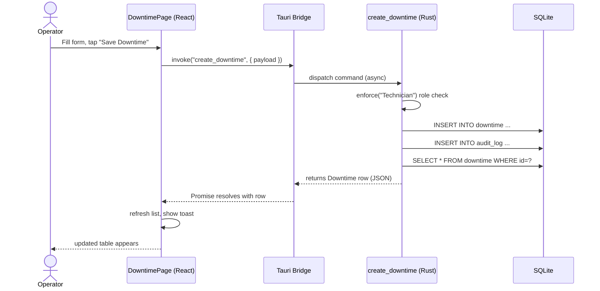
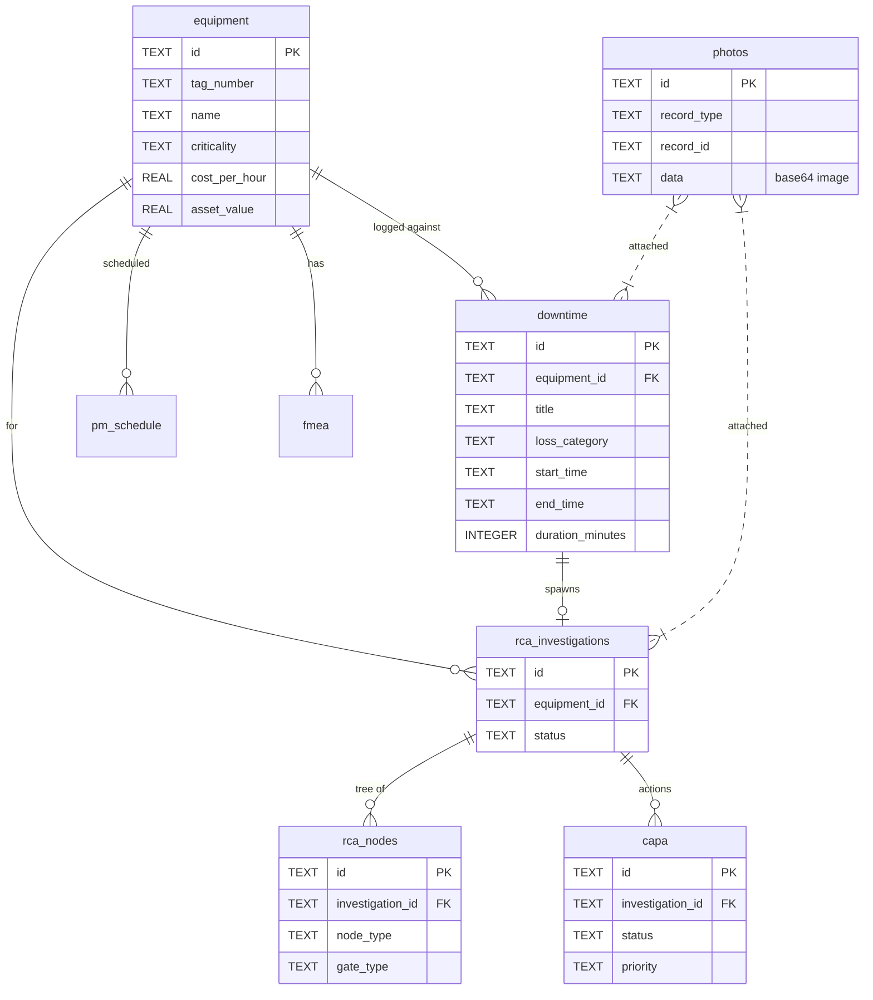
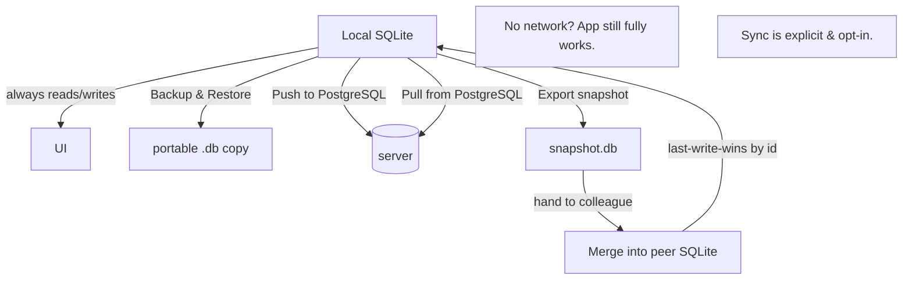

# TPM-RCA — Codebase Instruction Manual & Visual Map

> An offline-first, zero-infrastructure desktop app for **Total Productive Maintenance**
> and **Root-Cause Analysis**. This manual explains what the code is, how it runs,
> and how the pieces fit together, with diagrams you can follow without reading
> every file.

---

## 1. What this app is (in one minute)

TPM-RCA is a **Tauri desktop application**. That means:

- A tiny **Rust** backend runs locally and owns all data access.
- A **React + TypeScript** web UI is rendered inside a native system webview.
- All data lives in a **local SQLite file** — the app works with **no network**.
- Optional sync pushes/pulls that local data to a **PostgreSQL** server, or merges
  it with another install on the **LAN** (peer sync) — no server in the middle.

Because nothing leaves the device unless you explicitly sync, the plant can run
with zero IT dependency.

---

## 2. High-level architecture

```mermaid
flowchart TD
    User([Operator / Engineer]) -->|clicks, types, scans| UI[React UI\nSrc: src/]

    subgraph Frontend["Frontend (src/) — bundled by Vite"]
        UI --> Ctx[React Contexts\nAuth · Role · Theme · Language\nToast · Tour/Help · Assistant]
        UI --> Lib[lib/ helpers\nassistant · csv · drafts · finance\nreliability · cbm · voice · export]
        UI --> Invoke[invoke()\n@tauri-apps/api/core]
    end

    Invoke -->|IPC over Tauri bridge| Cmd[#[tauri::command] handlers\nSrc: src-tauri/src/commands/]

    subgraph Backend["Backend (src-tauri/) — Rust"]
        Cmd --> Svc[services/\nai · auth · cbm · reliability\nintegrations · jwt · notifications]
        Cmd --> Sync[sync/mod.rs\nPostgres push/pull\n+ LAN peer merge]
        Cmd --> Models[models/mod.rs\nStructs ⇄ Rows]
    end

    Models --> DB[(SQLite file\nlocal, offline-first)]
    Sync -->|opt-in| PG[(PostgreSQL\ncentral server)]
    Sync -->|opt-in| Peer[(Peer snapshot\nanother install on LAN)]

    DB -.backup/restore.-> UI
```

**The one rule to remember:** the UI never touches the database directly. Every
read/write goes *UI → `invoke("command")` → Rust command → SQLite → result*.

---

## 3. How a single action runs (runtime sequence)

Example: an operator logs a downtime event on the floor.



This same pattern repeats for **every** feature: a page calls `invoke`, a Rust
`#[tauri::command]` validates the session/role, touches SQLite (and optionally
audit/logs), and returns a serialised struct.

---

## 4. Technology stack

| Layer | Choice |
|-------|--------|
| Desktop shell | **Tauri v2** (Rust + native webview) |
| UI framework | **React 19** + **TypeScript** |
| Build / dev | **Vite 7** |
| Styling | **Tailwind CSS v4** |
| Charts | Recharts, reactflow (RCA tree) |
| Local DB | **SQLite** via `sqlx` |
| Server sync | **PostgreSQL** via `sqlx` (optional) |
| QR scanning | `qrcode.react` (render) + `jsqr` (camera decode) |
| Tests | **Vitest** (frontend), **cargo** (Rust) |

---

## 5. Frontend map (`src/`)

```mermaid
flowchart LR
    subgraph Core["Core"]
        App[App.tsx\nproviders + page switch]
        Main[main.tsx]
    end

    subgraph State["Contexts (state)"]
        Auth[AuthContext]
        Role[RoleContext]
        Theme[ThemeContext]
        Lang[LanguageContext]
        Toast[ToastContext]
        Tour[TourContext\nHelp + Tour]
        Asst[AssistantContext\nRuca assistant]
    end

    subgraph UI["Components"]
        Side[Sidebar]
        UIKIT[ui.tsx\nButton/Card/Modal...]
        Tag[TagScanner\nNFC + QR + camera]
        Photo[PhotoCapture\ncamera + upload]
        AsstUI[Assistant\nfloating chat]
        Coach[RcaCoach]
        Charts[OEEWidget / MTTRChart\nReliabilityPanel]
    end

    subgraph Pages["Pages (one per module)"]
        Dash[Dashboard] Eq[Equipment] Hier[Hierarchy]
        Down[Downtime] RCA[RCA] CAPA[CAPA] PM[PM Scheduler]
        Task[Tasks] Time[Timeline] Aud[Audit] FMEA[FMEA] CBM[CBM]
        Know[Knowledge] Fin[Financials] Inv[Inventory]
        WO[Work Orders] TS[Timesheets] Sched[Schedule]
        Rep[Reports] Sync[Sync] Users[Users] About[About]
    end

    subgraph Lib["lib/ (pure helpers)"]
        A[assistant] CSV[csv] Draft[drafts]
        Fin2[finance] Rel[reliability] CBM2[cbm]
        Voice[voice] Exp[export] Rep2[report] KN[knowledge]
    end

    App --> State
    App --> Side
    App --> Pages
    Pages --> UI
    Pages --> Lib
    UI --> Lib
```

### Contexts (global state)
| Context | Responsibility |
|---------|----------------|
| `AuthContext` | current user, login/logout, session |
| `RoleContext` | permissions that filter which nav items appear |
| `ThemeContext` | dark / light mode |
| `LanguageContext` | UI language (i18n) |
| `ToastContext` | transient notifications |
| `TourContext` | first-run tour + `?` help panel (Ruca) |
| `AssistantContext` | open state + current page for the assistant |

### Key reusable pieces (`components/ui.tsx`)
`Button`, `Card`, `Input`, `Select`, `Textarea`, `Modal`, `Badge`, `Field`,
`StatCard`, `PageHeader`, `TableCard`, `LoadingState`, `Banner`, `Info` — every
page is built from these so the look stays consistent.

---

## 6. Backend map (`src-tauri/src/`)

```mermaid
flowchart TD
    Main[main.rs / lib.rs] --> Setup[setup()\ninit DB + manage state]
    Setup --> DBinit[db/mod.rs\nconnect SQLite + run migrations]
    Main --> Handler[invoke_handler!\nregisters every command]

    Handler --> Cmds[commands/]
    Handler --> Svc[services/]

    Cmds --> Cmod[mod.rs\n~60 commands + auth/enforce]
    Cmds --> Caudit[audit.rs] Cmds --> Cbackup[backup.rs]
    Cmds --> Chier[hierarchy.rs] Cmds --> Cinv[inventory.rs]
    Cmds --> Cknow[knowledge.rs] Cmds --> Cnotif[notifications.rs]
    Cmds --> Creport[reports.rs] Cmds --> Ctimeline[timeline.rs]
    Cmds --> Cwo[workorders.rs] Cmds --> Crole[role.rs]
    Cmds --> Cphoto[photos.rs\nadd/get/delete/update_photo]

    Svc --> Sai[ai.rs\nrca_coach_report]
    Svc --> Sauth[auth.rs] Svc --> Scbm[cbm.rs]
    Svc --> Srel[reliability.rs] Svc --> Sjwt[jwt.rs]
    Svc --> Snotif[notifications.rs] Svc --> Sint[integrations.rs]

    Cmds --> Models[models/mod.rs\nstructs for every table]
    Cmds --> Sync[sync/mod.rs]
    Sync --> PG[(PostgreSQL)]
    Sync --> Peer[(Peer DB file)]
```

### Command modules
| Module | What it serves |
|--------|----------------|
| `commands/mod.rs` | equipment, downtime, RCA, CAPA, PM, users, sync config, FMEA, auth |
| `commands/photos.rs` | attach/retrieve/delete/edit photos on downtime & RCA |
| `commands/audit.rs` | append to the immutable `audit_log` |
| `commands/backup.rs` | backup & restore the whole SQLite file |
| `commands/hierarchy.rs` | plants / areas |
| `commands/inventory.rs` | spare parts + transactions |
| `commands/knowledge.rs` | tribal-knowledge notes |
| `commands/notifications.rs` | in-app alerts + preferences |
| `commands/reports.rs` | scheduled report generation |
| `commands/timeline.rs` | unified maintenance timeline |
| `commands/workorders.rs` | work orders + labor/parts |
| `commands/role.rs` | permission sets |

### Services (business logic, not commands)
| Service | Purpose |
|---------|---------|
| `ai.rs` | rule-based RCA coach (failure modes + CAPA from history) |
| `auth.rs` / `jwt.rs` | password hashing, token issue/verify |
| `reliability.rs` | MTBF/MTTR/reliability analytics |
| `cbm.rs` | condition-based maintenance triggers |
| `integrations.rs` | external integrations |
| `notifications.rs` | alert generation |

---

## 7. Data model (the important tables)



Migrations live in `src-tauri/migrations/` and run automatically on startup
(`db/mod.rs` → `sqlx::migrate!`). **Add new tables by adding a new timestamped
`.sql` file there — never hand-edit a shipped migration.**

---

## 8. Offline-first & sync model



Key facts:
- **Offline drafts** (`lib/drafts.ts`) store incomplete downtime entries in
  `localStorage` so they can be submitted later.
- **Postgres sync** (`sync_to_postgres` / `sync_from_postgres`) upserts six core
  tables plus `photos`, with last-write-wins conflict resolution.
- **Peer (LAN) sync** exports a clean SQLite copy (`VACUUM INTO`) and merges it
  into another install — login & server config are intentionally excluded so each
  device keeps its own identity.
- Photos are stored as base64 inside SQLite, so they ride along with backups and
  peer merges automatically.

---

## 9. Feature / page map

| Page | What the operator does there |
|------|------------------------------|
| Dashboard | live KPIs: availability, MTTR, MTBF, OEE, open downtime |
| Equipment | asset register; QR tags; CSV import/export; cost fields |
| Hierarchy | plants → areas → equipment |
| Downtime | log events (voice / NFC / QR / draft), close, **photos** |
| RCA | build cause tree; Ruca coach; **photos** |
| CAPA | corrective/preventive actions linked to RCA |
| PM Scheduler | preventive tasks + attachments |
| Tasks / Timeline / Audit | personal work, unified history, traceability |
| FMEA / CBM | risk ranking, condition-based triggers |
| Knowledge | tribal-knowledge notes & photos |
| Financials / Inventory / Work Orders / Timesheets | cost, spares, jobs, labour |
| Schedule / Reports | planning calendar, exports |
| Sync | backup/restore + Postgres + LAN peer |
| Users | roles & permissions (admin) |
| About | how the app is built & runs |
| **Ruca Assistant** | floating chat on every page — contextual tips + Q&A |

### Shop-floor capture (the "zero-friction" layer)
Three ways to identify an asset, all resolving to the same id:
- **NFC** tap (`TagScanner` → `NDEFReader`)
- **QR** — camera scan (`jsqr`) or paste of `tpm-rca://equipment/<id>`
- **Voice** dictation (`lib/voice.ts`, Web Speech API)

All of it works offline; photos are captured via camera or upload and attached
to the record.

---

## 10. How to run it

```bash
# install frontend deps (already done once)
npm install

# launch the desktop app in development
npm run tauri dev

# produce a native installer
npm run tauri build

# frontend-only checks
npm run typecheck     # TypeScript, no emit
npm test             # Vitest unit tests
npm run build        # tsc + vite production build
```

> The Rust side compiles with `cargo`. `npm run tauri dev` drives both the
> frontend dev server and the Rust build together. The local database path is
> `sqlite:C:/Users/edosa/project/tpm_rca.db` unless `DATABASE_URL` overrides it.

---

## 11. How to extend it (cookbook)

### Add a new backend command
1. Write the function in the right `commands/*.rs` with `#[tauri::command]`.
2. Gate writes with `enforce(&session, "Technician")?` (or `Engineer`/`Admin`).
3. Add `pub use` / module declaration in `commands/mod.rs` if it's a new file.
4. Register the function in the `invoke_handler!([...])` list in `lib.rs`.
5. Call it from the frontend with `invoke("my_command", { ... })`.

```rust
#[tauri::command]
pub async fn greet_name(pool: State<'_, SqlitePool>, name: String) -> Result<String, String> {
    Ok(format!("hello {name}"))
}
```

### Add a new page
1. Create `src/pages/MyPage.tsx` exporting a default component.
2. Import it in `App.tsx`, add it to the `Page` union type, render it in the
   `activePage === "mykey"` switch, and (optionally) add a `baseNav` entry with a
   matching icon in `Sidebar.tsx`.

### Add a new table
1. Create `src-tauri/migrations/<timestamp>_create_<name>_table.sql`.
2. Add the matching struct in `models/mod.rs`.
3. Add commands that read/write it and register them (see above).

---

## 12. Quick mental model

> **React renders. Rust decides. SQLite remembers. Sync is optional.**

If you remember that sentence and the diagram in §2, you can navigate the entire
codebase: a page calls `invoke`, a Rust command validates and stores, and the
UI re-renders from the result. Everything else — assistant, photos, QR/NFC,
sync — is built on top of that single loop.
